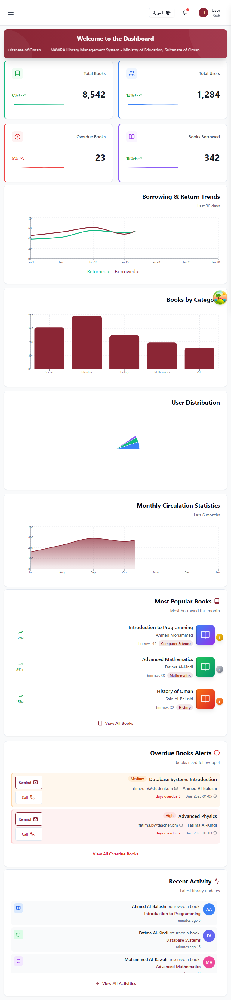

# 🧪 NAWRA Library Management System - Testing Guide

## Table of Contents
1. [Introduction](#introduction)
2. [Prerequisites](#prerequisites)
3. [Quick Start - Testing in 5 Minutes](#quick-start)
4. [Setting Up the Test Environment](#setting-up-the-test-environment)
5. [Running Manual Tests](#running-manual-tests)
6. [Running Automated Tests](#running-automated-tests)
7. [Test Credentials](#test-credentials)
8. [Feature Testing Checklist](#feature-testing-checklist)
9. [Common Issues and Solutions](#common-issues-and-solutions)
10. [Generating Screenshots](#generating-screenshots)

---

## Introduction

This guide will help you test the NAWRA Library Management System, whether you're a developer, QA tester, or just want to explore the application. No prior experience is required!

**What You'll Learn:**
- ✅ How to set up and run the application
- ✅ How to test all features manually
- ✅ How to run automated tests
- ✅ How to verify bilingual support (English/Arabic)
- ✅ How to capture screenshots for documentation

---

## Prerequisites

### Required Software

**Option 1: Using Docker (Easiest - Recommended)**
- 🐳 [Docker Desktop](https://www.docker.com/products/docker-desktop) (includes Docker Compose)
- That's it! Everything else runs in containers.

**Option 2: Manual Installation**
- 📦 [Node.js 18+](https://nodejs.org/) (for frontend)
- 🐍 [Python 3.11+](https://www.python.org/) (for backend)
- 🐘 PostgreSQL 15+ or [Supabase Account](https://supabase.com/) (for database)
- 💻 Git (for cloning the repository)

### Optional Tools
- 🌐 Modern web browser (Chrome, Firefox, Safari, or Edge)
- 📝 API testing tool like [Postman](https://www.postman.com/) or [Thunder Client](https://www.thunderclient.com/)

---

## Quick Start

### 🚀 Get Testing in 5 Minutes!

```bash
# 1. Clone the repository
git clone https://github.com/your-username/nawra-lms.git
cd nawra-lms

# 2. Start everything with Docker
docker-compose up -d

# 3. Wait 30 seconds for services to start, then open:
# Frontend: http://localhost:3000
# Backend API: http://localhost:8000/docs

# 4. Login with test credentials:
# Email: admin@nawra.om
# Password: Admin@123
```

**That's it!** You're now ready to test the application! 🎉

---

## Setting Up the Test Environment

### Method 1: Docker Setup (Recommended)

#### Step 1: Clone the Repository
```bash
git clone https://github.com/your-username/nawra-lms.git
cd nawra-lms
```

#### Step 2: Configure Environment Variables
```bash
# Copy the example environment files
cp backend/.env.example backend/.env
cp frontend/.env.local.example frontend/.env.local

# Edit .env files with your credentials (if needed)
# For quick testing, the defaults work fine
```

#### Step 3: Start Services
```bash
# Start all services in the background
docker-compose up -d

# Check if services are running
docker-compose ps

# View logs if needed
docker-compose logs -f
```

#### Step 4: Verify Setup
```bash
# Check backend health
curl http://localhost:8000/health

# Check frontend (open in browser)
open http://localhost:3000
```

### Method 2: Manual Setup

<details>
<summary><b>Click to expand manual setup instructions</b></summary>

#### Backend Setup

```bash
# Navigate to backend directory
cd backend

# Create virtual environment
python -m venv venv

# Activate virtual environment
# On macOS/Linux:
source venv/bin/activate
# On Windows:
venv\Scripts\activate

# Install dependencies
pip install -r requirements.txt

# Setup environment variables
cp .env.example .env
# Edit .env with your Supabase credentials

# Run database migrations
python run_migration.py

# Create test users
python create_dev_user.py

# Start backend server
uvicorn main:app --reload --port 8000
```

#### Frontend Setup

```bash
# Open a new terminal
cd frontend

# Install dependencies
npm install

# Setup environment variables
cp .env.local.example .env.local
# Edit .env.local to point to your backend

# Start frontend development server
npm run dev
```

The application will be available at:
- Frontend: http://localhost:3000
- Backend API: http://localhost:8000
- API Documentation: http://localhost:8000/docs

</details>

---

## Running Manual Tests

### Test 1: Login and Authentication

#### English Interface
1. Open http://localhost:3000/en/login
2. You should see the login page

**What to Test:**
- ✅ Page loads without errors
- ✅ All text is in English
- ✅ Form fields are clearly labeled
- ✅ Password field has show/hide button

**Test Login:**
```
Email: admin@nawra.om
Password: Admin@123
```

3. Click "Sign In" button
4. You should be redirected to the dashboard

#### Arabic Interface
1. Open http://localhost:3000/ar/login
2. Page should be Right-to-Left (RTL)

**What to Test:**
- ✅ Page layout is mirrored (RTL)
- ✅ All text is in Arabic
- ✅ Form still works correctly
- ✅ Login redirects to Arabic dashboard

---

### Test 2: Dashboard Overview

After logging in, you should see the dashboard:


*Dashboard in English - showing statistics, charts, and quick actions*


*Dashboard in Arabic - complete RTL layout with all statistics*

**What to Test:**

#### Statistics Cards
- ✅ Total Books count is displayed
- ✅ Active Borrowers count is displayed
- ✅ Books On Loan count is displayed
- ✅ Overdue Items count is displayed
- ✅ Numbers update in real-time

#### Charts and Graphs
- ✅ Circulation trends chart displays data
- ✅ Popular categories bar chart shows data
- ✅ Recent activity list is populated
- ✅ Charts are responsive to window size

#### Quick Actions
- ✅ "Check Out Book" button works
- ✅ "Check In Book" button works
- ✅ "Add New Book" button works
- ✅ "Register Patron" button works

#### Navigation
- ✅ Sidebar menu is visible
- ✅ All menu items are clickable
- ✅ Language switcher works (EN/AR)
- ✅ User profile dropdown works

---

### Test 3: Books/Catalog Management

Navigate to Books section from the sidebar:

**What to Test:**

#### Book List View
- ✅ Books are displayed in a table/grid
- ✅ Search functionality works
- ✅ Filters work (status, category, author)
- ✅ Pagination works correctly
- ✅ Sort by title, author, date works

#### Adding a New Book
1. Click "Add New Book" button
2. Fill in book details:
   - Title (English and Arabic)
   - Author
   - ISBN
   - Category
   - Publication Year
   - Number of Copies
3. Click "Save"
4. Book should appear in the list

**What to Test:**
- ✅ Form validation works (required fields)
- ✅ ISBN format validation
- ✅ Bilingual input for title/description
- ✅ Book is saved to database
- ✅ Success message is displayed

#### Editing a Book
1. Click on any book
2. Click "Edit" button
3. Modify any field
4. Click "Save"

**What to Test:**
- ✅ Changes are saved
- ✅ Book details update immediately
- ✅ No data loss on edit

#### Deleting a Book
1. Click on a book
2. Click "Delete" button
3. Confirm deletion

**What to Test:**
- ✅ Confirmation dialog appears
- ✅ Book is removed after confirmation
- ✅ Cannot delete if book is currently borrowed

---

### Test 4: Circulation Operations

Navigate to Circulation section:

**Check Out Process:**
1. Click "Check Out" button
2. Scan or enter patron barcode
3. Scan or enter book barcode
4. Verify details
5. Click "Complete Check Out"

**What to Test:**
- ✅ Patron details load correctly
- ✅ Book availability is checked
- ✅ Due date is automatically calculated
- ✅ Transaction is recorded
- ✅ Book status changes to "Checked Out"
- ✅ Email notification sent (if configured)

**Check In Process:**
1. Click "Check In" button
2. Scan or enter book barcode
3. Click "Complete Check In"

**What to Test:**
- ✅ Book status changes to "Available"
- ✅ Overdue fines calculated (if late)
- ✅ Transaction history updated
- ✅ Book can be checked out again

**Renewals:**
1. Go to patron profile
2. View borrowed books
3. Click "Renew" on a book

**What to Test:**
- ✅ Due date is extended
- ✅ Renewal limit is enforced
- ✅ Cannot renew if holds exist
- ✅ Renewal history is tracked

---

### Test 5: User Management

Navigate to Users section:

#### Viewing Users
**What to Test:**
- ✅ All users are listed
- ✅ User roles are displayed (Admin, Librarian, Patron, etc.)
- ✅ Search by name/email works
- ✅ Filter by role works
- ✅ User status (Active/Inactive) is shown

#### Adding a New User
1. Click "Add New User" button
2. Fill in user details:
   - Full Name
   - Email
   - Phone
   - User Type (Patron, Staff, etc.)
   - Barcode (auto-generated or manual)
3. Click "Save"

**What to Test:**
- ✅ Email validation works
- ✅ Unique barcode generation
- ✅ Default password is set
- ✅ User receives welcome email (if configured)
- ✅ User can login immediately

#### Editing User Permissions
1. Click on a user
2. Click "Edit Permissions" tab
3. Select role (Administrator, Librarian, etc.)
4. Click "Save"

**What to Test:**
- ✅ Permissions are applied immediately
- ✅ User access changes based on role
- ✅ Cannot remove own admin access
- ✅ Audit log records changes

---

### Test 6: Reports and Analytics

Navigate to Reports section:


*Reports page showing various analytics and export options*

**What to Test:**

#### Predefined Reports
- ✅ Circulation Statistics report
- ✅ Overdue Items report
- ✅ Popular Books report
- ✅ User Activity report
- ✅ Collection Analysis report

#### Report Generation
1. Select a report type
2. Choose date range
3. Apply filters (if available)
4. Click "Generate Report"

**What to Test:**
- ✅ Report generates without errors
- ✅ Data is accurate
- ✅ Charts/graphs display correctly
- ✅ Can export to CSV
- ✅ Can export to PDF
- ✅ Can export to Excel

#### Custom Reports
1. Click "Create Custom Report"
2. Select fields to include
3. Add filters
4. Click "Generate"

**What to Test:**
- ✅ Custom queries work
- ✅ Multiple filters can be combined
- ✅ Results can be saved
- ✅ Scheduled reports work (if implemented)

---

### Test 7: Settings Management

Navigate to Settings section:

**What to Test:**

#### System Settings
- ✅ Library name can be changed
- ✅ Contact information can be updated
- ✅ Opening hours can be set
- ✅ Logo can be uploaded
- ✅ Changes are saved

#### Circulation Settings
- ✅ Loan period can be configured
- ✅ Renewal limits can be set
- ✅ Fine amounts can be configured
- ✅ Hold periods can be set
- ✅ Settings apply to new transactions

#### Notification Settings
- ✅ Email templates can be edited
- ✅ SMS settings can be configured
- ✅ Reminder schedules can be set
- ✅ Test notifications can be sent

---

### Test 8: Responsive Design

Test the application on different screen sizes:

#### Desktop (1920x1080)


**What to Test:**
- ✅ All elements are properly aligned
- ✅ Sidebar is always visible
- ✅ Charts display full size
- ✅ Tables show all columns

#### Tablet (768x1024)


**What to Test:**
- ✅ Layout adapts to smaller screen
- ✅ Sidebar may collapse
- ✅ Tables are scrollable
- ✅ All features remain accessible

#### Mobile (375x812)


**What to Test:**
- ✅ Mobile-optimized layout
- ✅ Hamburger menu for navigation
- ✅ Cards stack vertically
- ✅ Forms are easy to fill
- ✅ Touch targets are large enough

---

### Test 9: Bilingual Support

#### Language Switching
1. Click language switcher in header
2. Switch between English (EN) and Arabic (AR)

**What to Test:**
- ✅ Entire interface translates
- ✅ URL changes (/en to /ar)
- ✅ Layout switches to RTL for Arabic
- ✅ User preference is saved
- ✅ Icons/images remain properly aligned

#### Bilingual Data Entry
1. Add a new book
2. Enter title in both English and Arabic
3. Save and view the book

**What to Test:**
- ✅ Both languages are stored
- ✅ Correct language displays based on interface
- ✅ Search works in both languages
- ✅ Reports show correct language

---

## Running Automated Tests

### Backend Tests (Python/Pytest)

```bash
# Navigate to backend directory
cd backend

# Activate virtual environment (if not already active)
source venv/bin/activate  # On Windows: venv\Scripts\activate

# Run all tests
pytest

# Run with coverage
pytest --cov=app --cov-report=html

# Run specific test file
pytest tests/test_auth.py

# Run with verbose output
pytest -v

# Run and stop on first failure
pytest -x
```

**Expected Output:**
```
============================= test session starts ==============================
collected 45 items

tests/test_auth.py ........                                              [ 17%]
tests/test_books.py .............                                        [ 46%]
tests/test_circulation.py ..........                                     [ 68%]
tests/test_users.py ...............                                      [100%]

============================== 45 passed in 12.34s ==============================
```

### Frontend Tests (Playwright)

```bash
# Navigate to frontend directory
cd frontend

# Install Playwright browsers (first time only)
npx playwright install

# Run all tests
npm test

# Run tests in headed mode (see browser)
npx playwright test --headed

# Run specific test file
npx playwright test tests/login.spec.ts

# Run tests in debug mode
npx playwright test --debug

# Run tests for specific project (chromium, firefox, webkit)
npx playwright test --project=chromium
```

**Expected Output:**
```
Running 24 tests using 4 workers

  ✓ [chromium] › login.spec.ts:3:1 › should login with valid credentials (2s)
  ✓ [chromium] › login.spec.ts:12:1 › should show error with invalid credentials (1s)
  ✓ [chromium] › dashboard.spec.ts:5:1 › should display dashboard statistics (3s)
  ...

24 passed (1m 15s)
```

### Running Specific Test Suites

#### API Tests
```bash
cd backend
pytest tests/api/ -v
```

#### Integration Tests
```bash
cd backend
pytest tests/integration/ -v
```

#### E2E Tests
```bash
cd frontend
npx playwright test tests/e2e/
```

#### Visual Regression Tests
```bash
cd frontend
npx playwright test tests/visual-validation.spec.ts
```

---

## Test Credentials

Use these pre-configured accounts for testing:

| Role | Email | Password | What You Can Test |
|------|-------|----------|-------------------|
| **Administrator** | `admin@nawra.om` | `Admin@123` | Full system access, all features |
| **Librarian** | `librarian@ministry.om` | `Librarian@123` | Catalog management, circulation |
| **Circulation Staff** | `circulation@ministry.om` | `Circ@123` | Check-in/out, renewals only |
| **Cataloger** | `cataloger@ministry.om` | `Cataloger@123` | Catalog management only |
| **Patron** | `patron@student.om` | `Patron@123` | End-user features, book search |

**Security Note:** These are test credentials only. Change them in production!

---

## Feature Testing Checklist

Use this checklist to ensure comprehensive testing:

### 🔐 Authentication & Authorization
- [ ] Login with valid credentials
- [ ] Login with invalid credentials (should fail)
- [ ] Logout functionality
- [ ] Password reset flow
- [ ] Session timeout
- [ ] Remember me functionality
- [ ] Role-based access control

### 📚 Catalog Management
- [ ] View books list
- [ ] Search books
- [ ] Filter by category, author, status
- [ ] Add new book
- [ ] Edit existing book
- [ ] Delete book (with validations)
- [ ] Bulk import books (CSV/Excel)
- [ ] Export books list
- [ ] Book details view

### 🔄 Circulation
- [ ] Check out book
- [ ] Check in book
- [ ] Renew book
- [ ] Place hold on book
- [ ] Cancel hold
- [ ] View circulation history
- [ ] Overdue book handling
- [ ] Fine calculation
- [ ] Multiple copies handling

### 👥 User Management
- [ ] View users list
- [ ] Add new user
- [ ] Edit user details
- [ ] Deactivate/activate user
- [ ] Assign roles
- [ ] View user borrowing history
- [ ] User search
- [ ] Patron self-registration (if enabled)

### 📊 Reports & Analytics
- [ ] Dashboard statistics
- [ ] Circulation reports
- [ ] Overdue reports
- [ ] Popular books report
- [ ] User activity report
- [ ] Collection analysis
- [ ] Export reports (CSV, PDF, Excel)
- [ ] Date range filtering

### ⚙️ Settings
- [ ] Update library information
- [ ] Configure circulation rules
- [ ] Manage notification templates
- [ ] Upload library logo
- [ ] Set opening hours
- [ ] Configure fine amounts

### 🌍 Bilingual Support
- [ ] Switch language (EN/AR)
- [ ] RTL layout for Arabic
- [ ] All text translates correctly
- [ ] Bilingual data entry
- [ ] Date/number formatting per locale

### 📱 Responsive Design
- [ ] Test on desktop (1920x1080)
- [ ] Test on tablet (768x1024)
- [ ] Test on mobile (375x812)
- [ ] Navigation on mobile
- [ ] Forms on mobile

### 🔒 Security
- [ ] SQL injection prevention
- [ ] XSS prevention
- [ ] CSRF protection
- [ ] Password encryption
- [ ] API rate limiting
- [ ] Input validation

---

## Common Issues and Solutions

### Issue 1: Frontend Won't Start

**Error:** `Port 3000 is already in use`

**Solution:**
```bash
# Find and kill process on port 3000
# On macOS/Linux:
lsof -ti:3000 | xargs kill -9

# On Windows:
netstat -ano | findstr :3000
taskkill /PID <PID> /F

# Or use a different port
npm run dev -- -p 3001
```

### Issue 2: Backend Connection Error

**Error:** `Could not connect to database`

**Solution:**
1. Check if Supabase credentials are correct in `.env`
2. Verify internet connection
3. Check Supabase project status
4. Try connection test:
```bash
cd backend
python -c "from app.db.supabase_client import get_supabase; print(get_supabase())"
```

### Issue 3: Login Not Working

**Error:** `Invalid credentials` even with correct password

**Solution:**
1. Ensure backend is running
2. Check backend logs for errors
3. Verify user exists in database
4. Try recreating test users:
```bash
cd backend
python create_dev_user.py
```

### Issue 4: Tests Failing

**Error:** `Test timeout` or `Cannot find element`

**Solution:**
1. Ensure application is running
2. Check correct ports (frontend: 3000, backend: 8000)
3. Increase timeout in test configuration
4. Run tests in headed mode to see what's happening:
```bash
npx playwright test --headed
```

### Issue 5: Screenshots Not Generating

**Error:** Playwright screenshot test fails

**Solution:**
1. Ensure frontend and backend are running
2. Check test user credentials
3. Increase wait times in test:
```bash
cd frontend
npx playwright test tests/capture-screenshots.spec.ts --headed
```

### Issue 6: Arabic Text Not Displaying

**Error:** Arabic text shows as boxes or question marks

**Solution:**
1. Ensure browser supports Arabic fonts
2. Check if i18n is configured correctly
3. Verify Arabic translation files exist in `/frontend/messages/ar.json`
4. Clear browser cache and reload

---

## Generating Screenshots

### Automatic Screenshot Generation

We've included a Playwright script to automatically capture screenshots:

```bash
# Navigate to frontend directory
cd frontend

# Ensure application is running
# Backend: http://localhost:8000
# Frontend: http://localhost:3000

# Run screenshot capture script
npx playwright test tests/capture-screenshots.spec.ts --headed

# Screenshots will be saved to: ../../docs/screenshots/
```

This will capture:
- ✅ Login pages (English & Arabic)
- ✅ Dashboard (English & Arabic)
- ✅ Books/Catalog page (English & Arabic)
- ✅ Circulation page (English & Arabic)
- ✅ Users management (English & Arabic)
- ✅ Reports page (English & Arabic)
- ✅ Settings page (English & Arabic)
- ✅ Mobile views
- ✅ Tablet views

### Manual Screenshots

If you prefer to take screenshots manually:

**On macOS:**
- Full screen: `Cmd + Shift + 3`
- Selected area: `Cmd + Shift + 4`

**On Windows:**
- Full screen: `Windows + PrintScreen`
- Selected area: `Windows + Shift + S`

**On Linux:**
- Full screen: `PrintScreen`
- Selected area: `Shift + PrintScreen`

**Using Browser DevTools:**
1. Open DevTools (F12)
2. Press `Cmd/Ctrl + Shift + P`
3. Type "screenshot"
4. Choose "Capture full size screenshot"

---

## Performance Testing

### Load Testing with Apache Bench

```bash
# Install Apache Bench
# On macOS: brew install httpd
# On Ubuntu: sudo apt-get install apache2-utils

# Test API endpoint
ab -n 1000 -c 10 http://localhost:8000/api/v1/books

# Results will show:
# - Requests per second
# - Time per request
# - Transfer rate
# - Percentage of requests served within certain time
```

### Expected Performance Metrics

- **API Response Time:** < 200ms for simple queries
- **Page Load Time:** < 2 seconds
- **Dashboard Load:** < 3 seconds
- **Search Results:** < 500ms
- **Concurrent Users:** Supports 100+ simultaneous users

---

## Continuous Integration

### GitHub Actions

The project includes automated testing with GitHub Actions:

```yaml
# .github/workflows/test.yml
# Tests run automatically on:
# - Every push to main/dev branches
# - Every pull request
# - Scheduled daily runs
```

**To view test results:**
1. Go to GitHub repository
2. Click "Actions" tab
3. View latest workflow runs
4. Click on any run to see detailed results

---

## Test Reporting

### Generate HTML Test Report

```bash
# Backend coverage report
cd backend
pytest --cov=app --cov-report=html
open htmlcov/index.html

# Frontend test report
cd frontend
npx playwright test
npx playwright show-report
```

### Test Metrics to Track

- **Code Coverage:** Aim for > 80%
- **Test Pass Rate:** Should be 100%
- **Test Execution Time:** Track trends
- **Bug Detection Rate:** Tests should catch bugs before production

---

## Getting Help

### If You're Stuck:

1. **Check Logs:**
   ```bash
   # Backend logs
   docker-compose logs backend

   # Frontend logs
   docker-compose logs frontend
   ```

2. **Check API Documentation:**
   - Open http://localhost:8000/docs
   - Interactive API testing available

3. **Run Health Check:**
   ```bash
   curl http://localhost:8000/health
   ```

4. **Ask for Help:**
   - 📧 Email: support@nawra.om
   - 🐛 GitHub Issues: [Create an issue](https://github.com/your-username/nawra-lms/issues)
   - 💬 Discussions: [GitHub Discussions](https://github.com/your-username/nawra-lms/discussions)

---

## Summary

You now know how to:
- ✅ Set up the testing environment
- ✅ Run manual tests on all features
- ✅ Execute automated tests
- ✅ Test bilingual functionality
- ✅ Verify responsive design
- ✅ Generate screenshots
- ✅ Troubleshoot common issues

**Next Steps:**
- Read the [User Guide](USER_GUIDE.md) to understand user workflows
- Check [API Documentation](http://localhost:8000/docs) for API details
- Review [Architecture Guide](architecture.md) for system design

---

**Happy Testing! 🧪**

*For questions or feedback, please open an issue on GitHub.*
