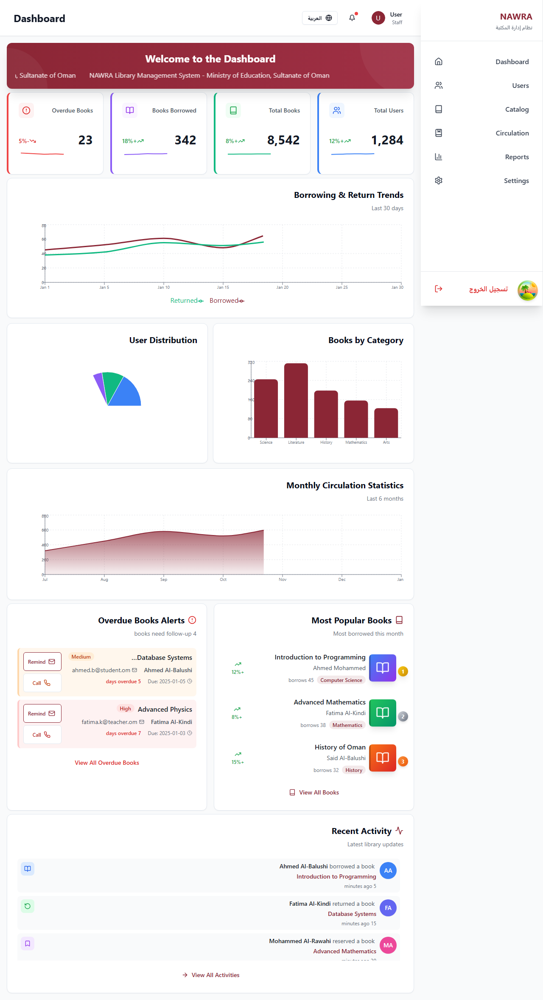
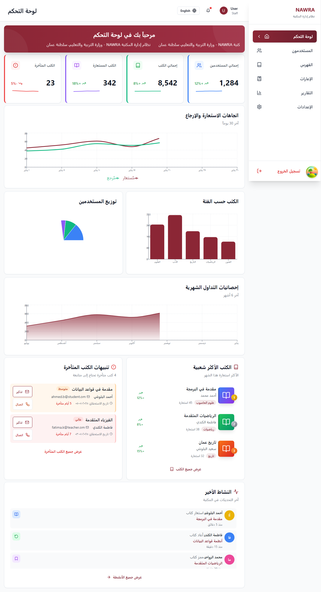
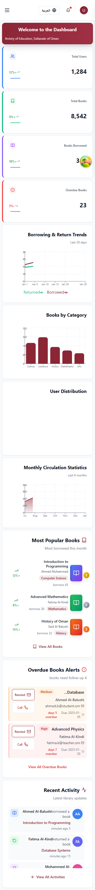

# 📚 NAWRA Library Management System - User Guide

## Welcome to NAWRA! نَوْرَة

This guide will help you learn how to use the NAWRA Library Management System effectively. Whether you're a librarian, administrator, or patron, this guide covers everything you need to know.

---

## Table of Contents

1. [Getting Started](#getting-started)
2. [Understanding Your Dashboard](#understanding-your-dashboard)
3. [Managing Books and Catalog](#managing-books-and-catalog)
4. [Circulation Operations](#circulation-operations)
5. [Managing Users and Patrons](#managing-users-and-patrons)
6. [Reports and Analytics](#reports-and-analytics)
7. [System Settings](#system-settings)
8. [Bilingual Features](#bilingual-features)
9. [Tips and Best Practices](#tips-and-best-practices)
10. [Frequently Asked Questions](#frequently-asked-questions)

---

## Getting Started

### Accessing NAWRA

1. **Open your web browser** (Chrome, Firefox, Safari, or Edge)
2. **Navigate to your library's NAWRA URL:**
   - Local: `http://localhost:3000`
   - Or your organization's URL: `https://your-library.nawra.om`

3. **Choose your language:**
   - English: `http://your-url/en/login`
   - Arabic: `http://your-url/ar/login`

### Logging In

**Step 1:** Enter your credentials
- **Email:** Your library-assigned email address
- **Password:** Your password (case-sensitive)

**Step 2:** Click the "Sign In" button

**First Time Login?**
- You'll receive an email with your temporary password
- You'll be prompted to change it on first login
- Choose a strong password (min 8 characters, mix of letters, numbers, symbols)

### User Roles Explained

NAWRA has different user roles with different permissions:

| Role | Icon | What You Can Do |
|------|------|-----------------|
| **👑 Administrator** | 🔐 | Everything! Full control of the system |
| **📚 Librarian** | 👨‍💼 | Manage books, users, circulation, reports |
| **🔄 Circulation Staff** | 📋 | Check out/in books, renewals, fines |
| **📝 Cataloger** | 📖 | Add and edit book records only |
| **👤 Patron** | 👥 | Search books, view your account, renew books |

---

## Understanding Your Dashboard

### Dashboard Overview

After logging in, you'll see your dashboard - your control center for the library system.

*Dashboard in English showing all key statistics and quick actions*

*Dashboard in Arabic with full RTL (Right-to-Left) support*

### Dashboard Components

#### 1. Statistics Cards (Top Row)

**📚 Total Books**
- Shows total number of books in your collection
- Click to view complete catalog

**👥 Active Borrowers**
- Shows patrons who currently have borrowed books
- Click to view active borrower list

**📖 Books On Loan**
- Shows how many books are currently checked out
- Click to view all borrowed books

**⚠️ Overdue Items**
- Shows books that are past their due date
- Click to view overdue list and send reminders

#### 2. Charts and Graphs (Middle Section)

**Circulation Trends**
- Line graph showing check-outs and check-ins over time
- Helps identify busy periods
- Useful for staff scheduling

**Popular Categories**
- Bar chart showing most borrowed book categories
- Helps with collection development decisions
- Hover over bars to see exact numbers

**Monthly Activity**
- Shows circulation activity by month
- Tracks library usage patterns

#### 3. Recent Activity (Right Side)

- Real-time feed of library activities
- Shows recent check-outs, check-ins, new books added
- Click any item for details

#### 4. Quick Actions (Prominent Buttons)

Four large buttons for common tasks:
- 📤 **Check Out Book** - Start lending process
- 📥 **Check In Book** - Return book process
- ➕ **Add New Book** - Add to catalog
- 👤 **Register Patron** - Add new user

#### 5. Navigation Sidebar (Left Side)

Your main menu for accessing all features:
- 🏠 **Dashboard** - Your home page
- 📚 **Books** - Catalog management
- 🔄 **Circulation** - Lending operations
- 👥 **Users** - Patron management
- 📊 **Reports** - Analytics and reports
- ⚙️ **Settings** - System configuration

---

## Managing Books and Catalog

### Viewing Your Collection

**To access the catalog:**
1. Click **"Books"** in the sidebar
2. You'll see a list of all books in your library

### Searching for Books

**Quick Search:**
1. Look for the search box at the top
2. Type book title, author name, or ISBN
3. Results appear instantly as you type

**Advanced Search:**
1. Click "Advanced Search" button
2. Fill in specific criteria:
   - Title (exact or partial)
   - Author
   - ISBN
   - Category
   - Publication Year
   - Status (Available, Checked Out, etc.)
3. Click "Search"

**Filtering:**
- Use dropdown filters to narrow results
- Filter by: Category, Status, Language, Location
- Combine multiple filters

### Adding a New Book

**Step 1:** Click "Add New Book" button

**Step 2:** Fill in Basic Information
- **Title (English):** Enter English title
- **Title (Arabic):** Enter Arabic title (if applicable)
- **Author:** Full author name
- **ISBN:** 13-digit ISBN (with or without dashes)
- **Publication Year:** Format: YYYY

**Step 3:** Fill in Classification
- **Category:** Select from dropdown (Fiction, Non-Fiction, Reference, etc.)
- **Dewey Decimal:** If using Dewey classification
- **Call Number:** Your library's call number system
- **Location:** Physical location in library

**Step 4:** Add Copy Information
- **Number of Copies:** How many physical copies
- **Barcode:** Scan or enter barcode for each copy
- **Condition:** New, Good, Fair, Poor

**Step 5:** Optional Details
- **Description:** Brief summary
- **Cover Image:** Upload book cover (JPG, PNG)
- **Publisher:** Publishing company
- **Language:** Primary language of the book
- **Pages:** Number of pages

**Step 6:** Click "Save"

✅ **Success!** Your book is now in the catalog

### Editing a Book

**To edit book details:**
1. Find the book (use search)
2. Click on the book title
3. Click "Edit" button
4. Modify any fields
5. Click "Save Changes"

**What can be edited:**
- ✅ Title and author information
- ✅ Classification details
- ✅ Number of copies
- ✅ Location
- ✅ Status
- ❌ Cannot edit: Original barcode, creation date

### Managing Multiple Copies

**If your book has multiple copies:**
1. Open book details
2. Go to "Copies" tab
3. View all copies with their:
   - Barcode
   - Status (Available, Checked Out, etc.)
   - Location
   - Condition

**Adding more copies:**
1. Click "Add Copy" button
2. Enter barcode
3. Select condition
4. Click "Add"

**Marking a copy as Lost/Damaged:**
1. Find the copy
2. Click "Change Status"
3. Select "Lost" or "Damaged"
4. Add notes (optional)
5. Click "Update"

### Bulk Import Books

**For adding many books at once:**

**Step 1:** Prepare your Excel/CSV file with columns:
- Title
- Author
- ISBN
- Category
- Year
- Copies
- Barcode (optional, can auto-generate)

**Step 2:** Click "Import Books" button

**Step 3:** Upload your file
- Supported formats: CSV, XLSX, XLS
- Max file size: 10MB
- Max records: 1000 per file

**Step 4:** Map your columns
- Match your file columns to NAWRA fields
- Preview shows first 5 rows

**Step 5:** Click "Import"
- Progress bar shows import status
- Any errors will be reported
- Successfully imported books appear in catalog

### Deleting a Book

**⚠️ Important:** You can only delete books that have never been borrowed.

**To delete:**
1. Open book details
2. Click "Delete" button
3. Confirm deletion
4. Book is permanently removed

**If book has history:**
- You'll see "Archive" option instead
- Archiving keeps the record but hides from active catalog
- Can be restored later if needed

---

## Circulation Operations

### Checking Out a Book

**Method 1: Barcode Scanning (Fastest)**

1. Click "Check Out Book" on dashboard
2. Scan patron's library card
   - Patron details appear automatically
3. Scan book barcode
   - Book details appear
   - System checks availability
4. Verify due date (automatically calculated)
5. Click "Complete Check Out"

✅ **Done!** Patron receives email confirmation (if enabled)

**Method 2: Manual Entry**

1. Click "Check Out Book"
2. Type patron ID or search by name
3. Select patron from results
4. Type book barcode or search by title
5. Select book from results
6. Click "Complete Check Out"

**What happens during check-out:**
- ✅ Book status changes to "Checked Out"
- ✅ Due date is set (based on loan policy)
- ✅ Patron's record updated
- ✅ Transaction recorded in history
- ✅ Patron receives confirmation (email/SMS)

### Checking In a Book

**Method 1: Barcode Scanning (Fastest)**

1. Click "Check In Book" on dashboard
2. Scan book barcode
3. System shows:
   - Book details
   - Borrower name
   - Original due date
   - Any fines (if overdue)
4. Click "Complete Check In"

✅ **Done!** Book is now available again

**Method 2: Manual Entry**

1. Click "Check In Book"
2. Type book barcode or search by title
3. Select book
4. Click "Complete Check In"

**If book is overdue:**
- ⚠️ System calculates fine automatically
- Shows fine amount to patron
- Options:
  - "Pay Now" - Record payment
  - "Add to Account" - Add to patron's balance
  - "Waive Fine" - If you have permission

**If book has holds:**
- 🔔 Alert appears: "This book has holds"
- System shows next patron in queue
- Options:
  - "Notify Patron" - Send pickup notification
  - "Place on Hold Shelf" - Move to hold location

### Renewing Books

**Patrons can renew online, or you can do it for them:**

**From Patron Account:**
1. Go to Users → Find patron
2. Click on patron name
3. Go to "Borrowed Books" tab
4. Find book to renew
5. Click "Renew" button

**System checks:**
- ✅ Renewal limit not exceeded
- ✅ No holds on this book
- ✅ Book not overdue beyond grace period

**If renewal is allowed:**
- Due date extended (based on policy)
- Patron notified
- Renewal counter incremented

**If renewal is denied:**
- Reason displayed (e.g., "Hold exists")
- Patron must return book

### Managing Holds/Reservations

**When a patron requests a book:**

**To place a hold:**
1. Go to book details
2. Click "Place Hold"
3. Search for patron
4. Click "Confirm Hold"

**Hold queue:**
- Shows all patrons waiting for this book
- Order is usually first-come, first-served
- You can prioritize (if you have permission)

**When book becomes available:**
1. System automatically notifies first patron in queue
2. Book status changes to "On Hold"
3. Hold expires after X days (based on policy)
4. If patron doesn't pick up, next in queue is notified

**From Circulation desk:**
1. Check in the book normally
2. System alerts about pending hold
3. Print hold slip
4. Place book on hold shelf
5. Notify patron

### Handling Overdue Books

**View overdue items:**
1. Click "Overdue Items" on dashboard
   OR
2. Go to Circulation → Overdue

**Overdue list shows:**
- Book title and barcode
- Borrower name
- Original due date
- Days overdue
- Fine amount
- Contact information

**Actions you can take:**
- **Send Reminder:** Email/SMS to patron
- **Call Patron:** Click to show phone number
- **Extend Due Date:** If there's a valid reason
- **Mark as Lost:** If patron can't return
- **Waive Fine:** If you have permission

**Automatic reminders:**
- System can send automatic reminders
- Configure in Settings → Notifications
- Typical schedule:
  - Day before due: Courtesy reminder
  - Day of due: Due date reminder
  - 3 days overdue: First overdue notice
  - 7 days overdue: Second notice
  - 14 days overdue: Final notice

### Fines and Fees

**How fines are calculated:**
- Based on settings in Settings → Circulation
- Typical: $0.25 per day per item
- Maximum fine cap (optional)
- Grace period (e.g., first day free)

**Recording fine payment:**
1. Go to patron's account
2. View "Fines & Fees" tab
3. Shows all outstanding fines
4. Click "Record Payment"
5. Enter amount paid
6. Select payment method (Cash, Card, etc.)
7. Click "Submit"

**Patron receives receipt (if email configured)**

**Waiving fines:**
1. Select fine to waive
2. Click "Waive Fine"
3. Enter reason (required)
4. Click "Confirm"
5. Action is logged in audit trail

---

## Managing Users and Patrons

### Viewing All Users

1. Click "Users" in sidebar
2. See list of all library users

**User list shows:**
- Name
- Email
- User Type (Patron, Staff, etc.)
- Status (Active, Inactive, Suspended)
- Join Date
- Number of Current Loans

### Adding a New Patron

**Step 1:** Click "Add New User" button

**Step 2:** Select User Type
- Patron (Regular library user)
- Student
- Faculty
- Staff
- Guest

**Step 3:** Fill in Personal Information
- **Full Name:** First and last name
- **Email:** Valid email address
- **Phone:** With country code
- **Date of Birth:** For age-appropriate services
- **Address:** Street, city, postal code

**Step 4:** Library Information
- **Barcode:** Can auto-generate or enter manually
- **User Group:** Undergraduate, Graduate, Faculty, etc.
- **Expiry Date:** When membership expires
- **Borrowing Limit:** Max books they can borrow
- **Branch:** If multi-branch system

**Step 5:** Account Settings
- **Username:** For login (usually email)
- **Temporary Password:** System can auto-generate
- **Send Welcome Email:** Check this box

**Step 6:** Click "Create User"

✅ **Success!** User can now login and use the system

### Editing User Information

**To update user details:**
1. Find user (use search)
2. Click on user's name
3. Click "Edit" button
4. Modify fields
5. Click "Save Changes"

**Common edits:**
- Phone number or address change
- Email update
- Extend expiry date
- Change borrowing limit

### Managing User Permissions

**To change user role:**
1. Open user details
2. Go to "Permissions" tab
3. Select new role:
   - Administrator
   - Librarian
   - Circulation Staff
   - Cataloger
   - Patron
4. Click "Update Role"

**Custom permissions:**
- Can enable/disable specific features
- Example: Allow patron to place holds but not renew
- Check/uncheck individual permissions
- Click "Save Permissions"

### Viewing User Activity

**To see what a patron has borrowed:**
1. Open patron's account
2. Go to "Borrowed Books" tab
3. See current loans with:
   - Book title
   - Checkout date
   - Due date
   - Renewal count
   - "Renew" button

**To see borrowing history:**
1. Go to "History" tab
2. See all past transactions:
   - Book
   - Checkout date
   - Return date
   - Was it late?
   - Fines paid

### Suspending a User Account

**When to suspend:**
- Multiple overdue items not returned
- Excessive fines
- Violation of library policies
- Graduation/employment end

**How to suspend:**
1. Open user account
2. Click "Suspend Account"
3. Select reason
4. Add notes (optional)
5. Click "Confirm"

**Suspended users:**
- Cannot borrow new books
- Can still return books
- Can pay fines
- Cannot place holds

**To reactivate:**
1. Open user account
2. Click "Activate Account"
3. Account immediately restored

### Deleting User Accounts

**⚠️ Important:**
- Cannot delete users with transaction history
- Can only deactivate them

**To deactivate:**
1. Open user account
2. Click "Deactivate"
3. User marked as inactive
4. Removed from active lists
5. Can be reactivated if needed

---

## Reports and Analytics

### Accessing Reports

1. Click "Reports" in sidebar
2. Choose from predefined reports or create custom

### Predefined Reports

#### 1. Circulation Statistics

**What it shows:**
- Total check-outs per day/week/month
- Total check-ins
- New registrations
- Active borrowers

**How to generate:**
1. Click "Circulation Statistics"
2. Select date range
3. Choose format (Chart, Table, Both)
4. Click "Generate"

**Best for:**
- Monthly board reports
- Tracking library usage trends
- Identifying busy periods

#### 2. Overdue Books Report

**What it shows:**
- All overdue items
- Borrower details
- Days overdue
- Fine amounts
- Contact information

**How to generate:**
1. Click "Overdue Books"
2. Optionally filter by:
   - Days overdue (e.g., > 7 days)
   - Fine amount (e.g., > $5)
   - Borrower type
3. Click "Generate"

**Best for:**
- Collections management
- Identifying patrons to contact
- Financial reporting

#### 3. Popular Books Report

**What it shows:**
- Most borrowed books
- Borrowing frequency
- Waiting list size
- Average loan period

**How to generate:**
1. Click "Popular Books"
2. Select time period
3. Choose top N books (e.g., top 10, 25, 50)
4. Click "Generate"

**Best for:**
- Collection development
- Purchase decisions
- Understanding patron interests

#### 4. Collection Analysis

**What it shows:**
- Total items by category
- Items never borrowed
- Items borrowed frequently
- Missing items
- Damaged items

**How to generate:**
1. Click "Collection Analysis"
2. Select categories to analyze
3. Click "Generate"

**Best for:**
- Weeding decisions
- Identifying gaps
- Budget allocation

#### 5. User Activity Report

**What it shows:**
- Active patrons vs. registered
- Average books per patron
- Most active borrowers
- Inactive patrons

**How to generate:**
1. Click "User Activity"
2. Define "active" period (e.g., borrowed in last 6 months)
3. Click "Generate"

**Best for:**
- Patron engagement
- Marketing campaigns
- Membership renewals

#### 6. Financial Report

**What it shows:**
- Fines collected
- Outstanding fines
- Payment methods breakdown
- Waivers issued

**How to generate:**
1. Click "Financial Report"
2. Select date range
3. Optionally group by payment method
4. Click "Generate"

**Best for:**
- Budget reports
- Audit preparation
- Revenue tracking

### Creating Custom Reports

**For specific queries:**
1. Click "Custom Report Builder"
2. Select data source:
   - Books
   - Patrons
   - Circulation Transactions
   - Fines
3. Choose fields to include (drag and drop)
4. Add filters (conditions)
5. Set sorting
6. Preview results
7. Click "Generate"

**Example custom reports:**
- "All science fiction books added in 2024"
- "Patrons who haven't borrowed in 1 year"
- "Books checked out more than 10 times"

### Exporting Reports

**All reports can be exported:**

**To export:**
1. Generate your report
2. Click "Export" button
3. Choose format:
   - **CSV** - For Excel/spreadsheet analysis
   - **PDF** - For printing/sharing
   - **Excel** - With formatting
4. Click "Download"

**Scheduled reports:**
- Can schedule reports to run automatically
- Daily, weekly, monthly
- Emailed to specified addresses
- Go to: Reports → Scheduled Reports → Add New

---

## System Settings

### Accessing Settings

1. Click "Settings" in sidebar (⚙️ icon)
2. Only visible if you have admin permissions

### Library Information

**Update basic details:**
- Library Name (English & Arabic)
- Contact Email
- Phone Number
- Address
- Website URL
- Opening Hours
- Holiday Closures

**Logo and Branding:**
1. Go to "Branding" tab
2. Click "Upload Logo"
3. Select image (PNG, JPG, max 2MB)
4. Logo appears in header and reports

### Circulation Policies

**Configure lending rules:**

**Loan Periods:**
- General Collection: X days
- Reference Books: Y days
- New Arrivals: Z days
- DVDs/Media: W days

**Renewal Policy:**
- Maximum renewals: 3
- Renewal period: Same as original
- Cannot renew if holds exist

**Fine Structure:**
- Daily fine: $0.25
- Maximum fine: $25.00
- Grace period: 1 day
- Lost book replacement fee: Cost + $10 processing

**Borrowing Limits:**
- Students: 5 books
- Faculty: 20 books
- Staff: 10 books
- Patrons: 3 books

### User Types and Roles

**Manage user categories:**
1. Go to "User Types" tab
2. View existing types
3. Click "Edit" to modify:
   - Loan limits
   - Loan periods
   - Renewal privileges
   - Hold privileges
4. Click "Add New Type" for custom categories

### Notification Templates

**Customize emails/SMS:**

**Available templates:**
- Welcome email
- Due date reminder
- Overdue notice
- Hold available notification
- Fine receipt
- Password reset

**To edit template:**
1. Go to "Notifications" tab
2. Click on template name
3. Edit content (supports variables like {patron_name}, {book_title})
4. Preview
5. Click "Save"

**Variables you can use:**
- `{patron_name}` - Patron's full name
- `{book_title}` - Book title
- `{due_date}` - Formatted due date
- `{fine_amount}` - Fine amount
- `{library_name}` - Your library name

**Notification Schedule:**
- Set when reminders are sent
- Enable/disable specific notifications
- Test send to yourself

### Integration Settings

**If using third-party services:**

**Email Service (SMTP):**
- Server address
- Port
- Username/Password
- TLS/SSL settings
- Test connection

**SMS Gateway:**
- Provider (Twilio, etc.)
- API credentials
- From number
- Test SMS

**Payment Gateway:**
- Provider (Stripe, PayPal, etc.)
- API keys
- Currency
- Test mode

### Backup and Restore

**Database Backups:**
1. Go to "Backup" tab
2. Click "Create Backup Now"
3. Backup downloads automatically

**Automatic backups:**
- Enable scheduled backups
- Daily at specified time
- Stored in cloud (if configured)
- Keeps last 30 days

**To restore:**
1. Go to "Restore" tab
2. Upload backup file
3. Click "Restore"
4. System will restart

⚠️ **Warning:** Restoring will overwrite current data

### Audit Log

**View all system changes:**
1. Go to "Audit Log" tab
2. See chronological list of all actions:
   - Who did it
   - What they did
   - When they did it
   - What changed

**Useful for:**
- Security
- Troubleshooting
- Accountability
- Compliance

**Filter audit log:**
- By user
- By action type
- By date range
- By module

---

## Bilingual Features

### Switching Languages

**Method 1: Language Switcher**
- Look for EN/AR toggle in header
- Click to switch
- Entire interface translates instantly

**Method 2: URL**
- English: `/en/...`
- Arabic: `/ar/...`
- Change URL language code

### Right-to-Left (RTL) Support

**When you switch to Arabic:**
- ✅ Entire layout mirrors
- ✅ Sidebar moves to right
- ✅ Text aligns right
- ✅ Icons and buttons flip position
- ✅ Charts remain readable

**Mixed content:**
- English book titles in Arabic interface display correctly
- Numbers format according to locale
- Dates show in appropriate calendar

### Bilingual Data Entry

**When adding books or users:**
1. You'll see fields for both languages
2. Example:
   - Title (English): "The Great Gatsby"
   - Title (Arabic): "غاتسبي العظيم"
3. Both are stored and searchable

**Display logic:**
- English interface shows English title
- Arabic interface shows Arabic title (if available)
- If Arabic not available, shows English in Arabic interface

### Language-Specific Search

**Search works in both languages:**
- Type Arabic to find Arabic titles
- Type English to find English titles
- Search is intelligent and finds matches

---

## Tips and Best Practices

### Daily Operations

**Start of Day Checklist:**
- [ ] Check overnight notifications
- [ ] Review overdue list
- [ ] Check hold shelf for expires
- [ ] Verify system is responding

**End of Day Checklist:**
- [ ] Review outstanding checkouts
- [ ] Empty book drop
- [ ] Send overdue reminders
- [ ] Backup important data (if not automatic)

### Efficient Workflows

**For faster check-out:**
1. Use barcode scanner (90% faster)
2. Keep patron cards handy
3. Verify patron briefly ("Is this you?")
4. Hand book back immediately

**For faster check-in:**
1. Scan as books arrive
2. Check for holds automatically
3. Sort by shelving location
4. Process in batches

**For adding new books:**
1. Use bulk import for multiple books
2. Prepare data in spreadsheet first
3. Use ISBN lookup if available
4. Add cover images later if pressed for time

### Common Shortcuts

**Keyboard shortcuts (when enabled):**
- `Alt + O` - Check Out
- `Alt + I` - Check In
- `Alt + B` - Search Books
- `Alt + U` - Search Users
- `/` - Focus search box
- `Esc` - Close dialog
- `Ctrl + K` - Command palette

### Data Quality

**Keep your catalog clean:**
- ✅ Use consistent author names
- ✅ Verify ISBNs before entry
- ✅ Use standard categories
- ✅ Update book condition regularly
- ✅ Remove duplicate entries

**User data quality:**
- ✅ Verify email addresses
- ✅ Keep phone numbers updated
- ✅ Update expired memberships
- ✅ Merge duplicate accounts

### Security Best Practices

**Password security:**
- Change default passwords immediately
- Use strong passwords (8+ chars, mixed case, numbers, symbols)
- Don't share passwords
- Change passwords regularly (every 90 days)
- Enable two-factor authentication if available

**Account security:**
- Log out when leaving desk
- Lock screen during breaks
- Don't let patrons behind circulation desk
- Review user permissions quarterly

**Data protection:**
- Don't share patron information
- Shred printed reports with personal data
- Clear screen before patron approaches
- Follow privacy policies

---

## Frequently Asked Questions

### General

**Q: What browsers are supported?**
A: Chrome, Firefox, Safari, and Edge. Keep your browser updated for best experience.

**Q: Can I use NAWRA on my phone/tablet?**
A: Yes! NAWRA is fully responsive and works on all devices.

**Q: Is my data safe?**
A: Yes, all data is encrypted and backed up regularly. Only authorized users can access.

**Q: Can I customize NAWRA?**
A: Yes, administrators can customize many settings, colors, logos, and policies.

### Books and Catalog

**Q: How do I add books in bulk?**
A: Use the "Import Books" feature. Prepare CSV/Excel with book data and upload.

**Q: Can I add ebooks?**
A: Yes, select "eBook" as format and add link instead of barcode.

**Q: What if two books have the same title?**
A: That's fine! Use ISBN to distinguish. Each record is unique.

**Q: How do I handle series/sets?**
A: Add each volume as separate record. Use "Series" field to link them.

### Circulation

**Q: What if a patron lost their card?**
A: Search by name, verify ID, then check out. Issue new card later.

**Q: Can patrons renew online?**
A: Yes, if enabled. They login and click "Renew" on their account.

**Q: What's the maximum fine?**
A: Configurable in Settings. Default is $25.00.

**Q: What if patron can't pay fine?**
A: Offer payment plan or refer to library director for waiver decision.

### Users

**Q: How do I reset a patron's password?**
A: Open their account, click "Reset Password", new password emailed to them.

**Q: Can patrons self-register?**
A: If enabled in Settings. Otherwise, staff must create accounts.

**Q: How long are accounts valid?**
A: Based on user type. Students: 4 years, Faculty: indefinite, Patrons: 1 year.

**Q: Can I merge duplicate accounts?**
A: Yes, administrators can merge accounts. Go to User → Merge Accounts.

### Reports

**Q: Can I schedule reports?**
A: Yes, go to Reports → Scheduled Reports → Add New.

**Q: How do I export to Excel?**
A: Generate report, click "Export", choose "Excel (.xlsx)".

**Q: Why is my report empty?**
A: Check date range and filters. Make sure there's data for the selected period.

### Technical

**Q: System is slow, what should I do?**
A: Clear browser cache, check internet connection, contact IT if persists.

**Q: I can't login, what should I do?**
A: Verify email and password. Click "Forgot Password" if needed. Contact admin if stuck.

**Q: Changes aren't saving, why?**
A: Check internet connection. Look for error messages. Try refreshing and re-entering.

**Q: Can I undo an action?**
A: Most actions can be reversed. Check-in reverses check-out, etc. Contact admin for help.

---

## Getting Help

### Built-in Help

**Context-sensitive help:**
- Look for (?) icons throughout the interface
- Hover for tooltips
- Click for detailed help

**Documentation:**
- Click "Help" in header
- Access full documentation
- Video tutorials (if available)

### Contact Support

**If you need assistance:**

📧 **Email:** support@nawra.om
- Response within 24 hours
- Include screenshots if possible
- Describe what you were trying to do

🐛 **Report a Bug:**
- Click "Report Issue" in footer
- Describe the problem
- Include steps to reproduce

💬 **Community:**
- Join NAWRA user community
- Share tips and tricks
- Learn from other libraries

📞 **Emergency Support:**
- For critical issues only
- Phone: [Your support number]
- Available during business hours

### Training Resources

**Getting started videos:**
- 5-minute quick tour
- Basic operations tutorial
- Advanced features walkthrough

**Webinars:**
- Monthly training sessions
- Q&A with experts
- Recorded for later viewing

**Documentation:**
- [Testing Guide](TESTING_GUIDE.md) - For testing the system
- [Architecture Guide](architecture.md) - Technical details
- [API Documentation](http://localhost:8000/docs) - For integrations

---

## Mobile Views

### Using NAWRA on Mobile

NAWRA is fully responsive and works great on phones and tablets!

*Dashboard optimized for mobile devices*

**Mobile features:**
- ✅ Touch-optimized buttons
- ✅ Swipe gestures
- ✅ Responsive tables
- ✅ Collapsible menus
- ✅ Barcode scanning via camera

**Mobile best practices:**
- Use in portrait mode for best experience
- Zoom in on small text if needed
- Use hamburger menu (☰) for navigation
- Pull down to refresh data

---

## Conclusion

Congratulations! You now know how to use the NAWRA Library Management System effectively.

**You've learned how to:**
- ✅ Navigate the dashboard
- ✅ Manage books and catalog
- ✅ Handle circulation operations
- ✅ Manage users and patrons
- ✅ Generate reports
- ✅ Configure system settings
- ✅ Use bilingual features

**Next steps:**
- Start using NAWRA with test data
- Explore advanced features
- Customize settings for your library
- Train your staff
- Go live!

---

**Need more help?**
- 📖 Read the [Testing Guide](TESTING_GUIDE.md)
- 🔧 Check [API Documentation](http://localhost:8000/docs)
- 💬 Join the [Community](https://github.com/your-username/nawra-lms/discussions)
- 📧 Contact [Support](mailto:support@nawra.om)

---

**Happy Library Management! 📚**

*NAWRA - نَوْرَة - Enlightening Knowledge*

---

**Document Version:** 1.0
**Last Updated:** 2025
**For:** NAWRA Library Management System

*This guide is regularly updated. Check for the latest version at your library's documentation center.*
